# Application for financial evidence for small shops

## Users can:

- see products
- create new products
- edit products that are not on some receipt or bill
- see suppliers
- create new suppliers
- edit suppliers which are not on some receipt or bill
- see all invoices
- create invoice
- see all bills
- create bills
- see overall report

## Technologies used

### Front-end:

- React
- CSS
- React Bootstrap

### Back-end:

- Spring Boot
- MySQL (for database) - Spring JPA

# Screenshots

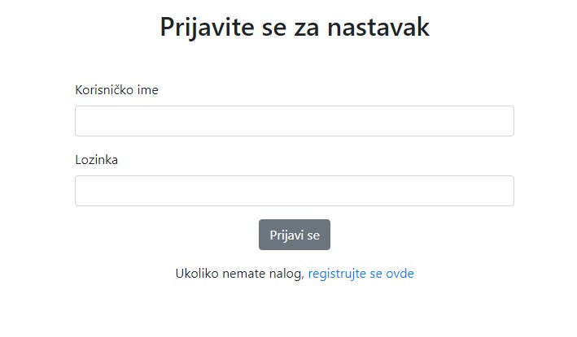
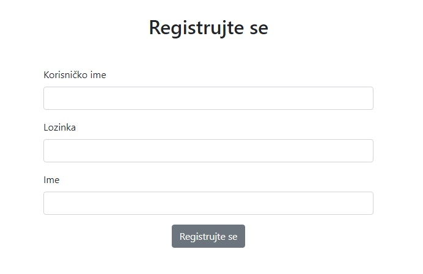
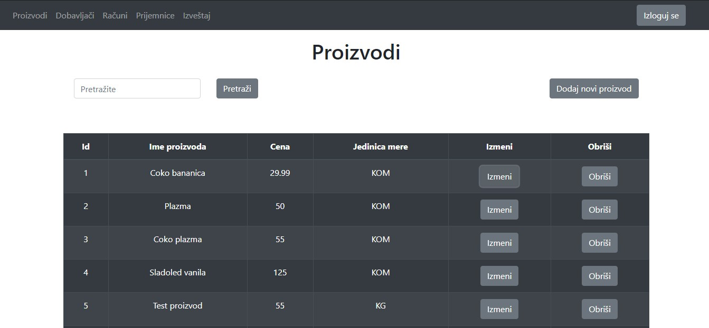
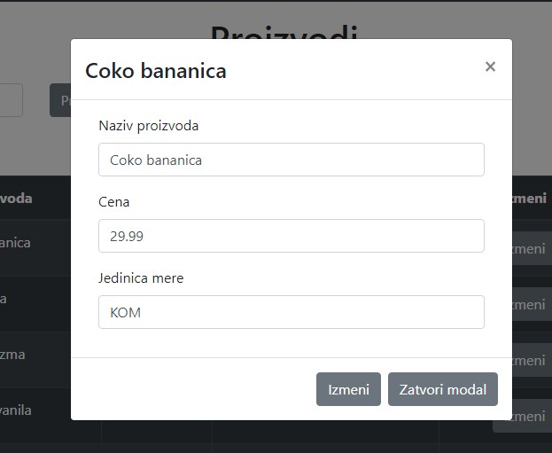
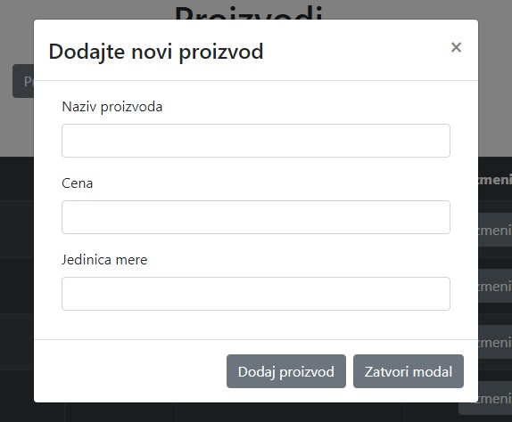
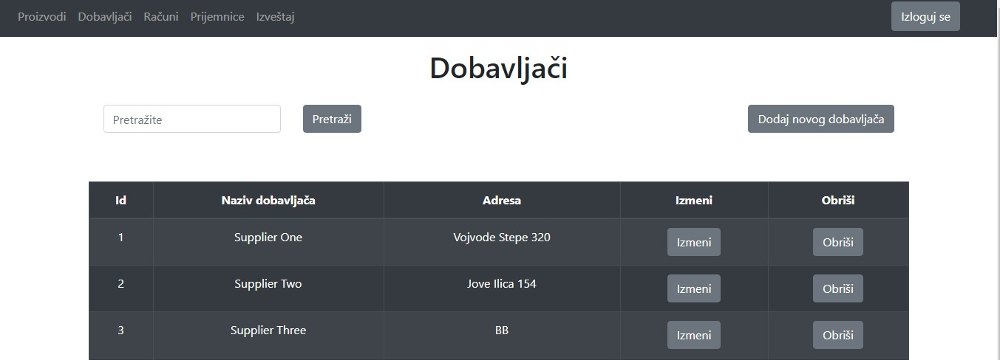
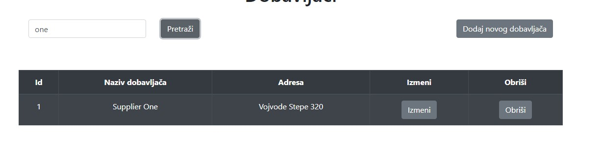
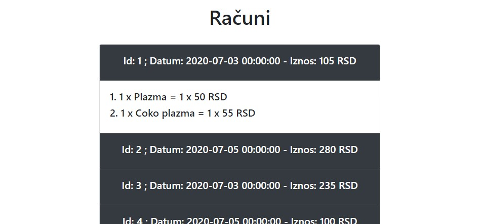
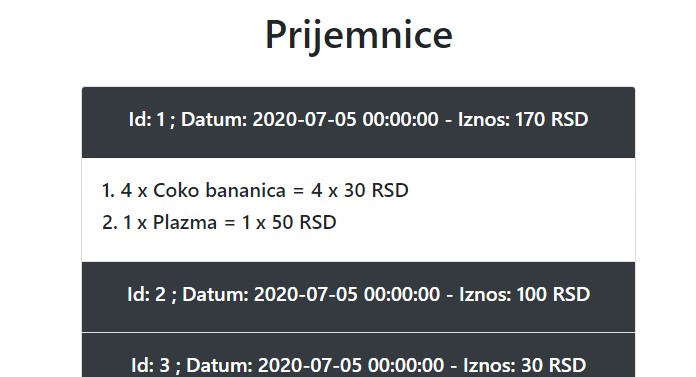
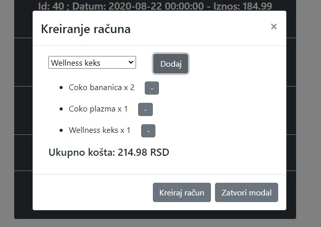
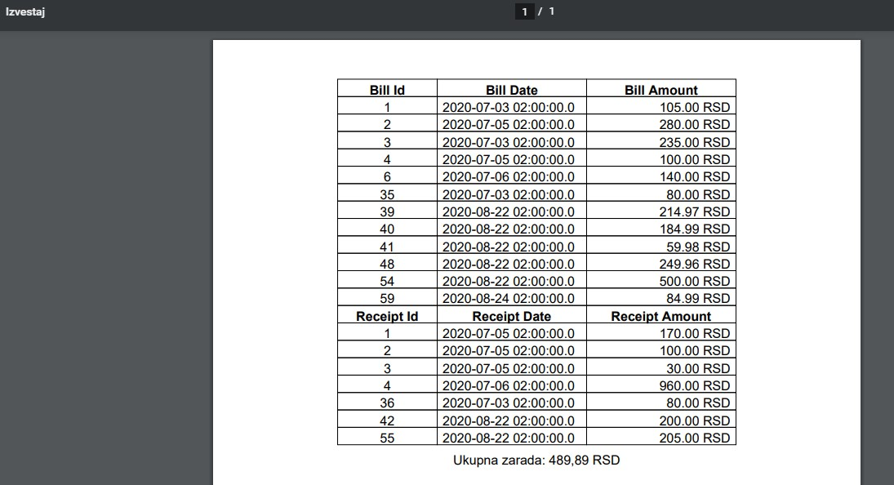
